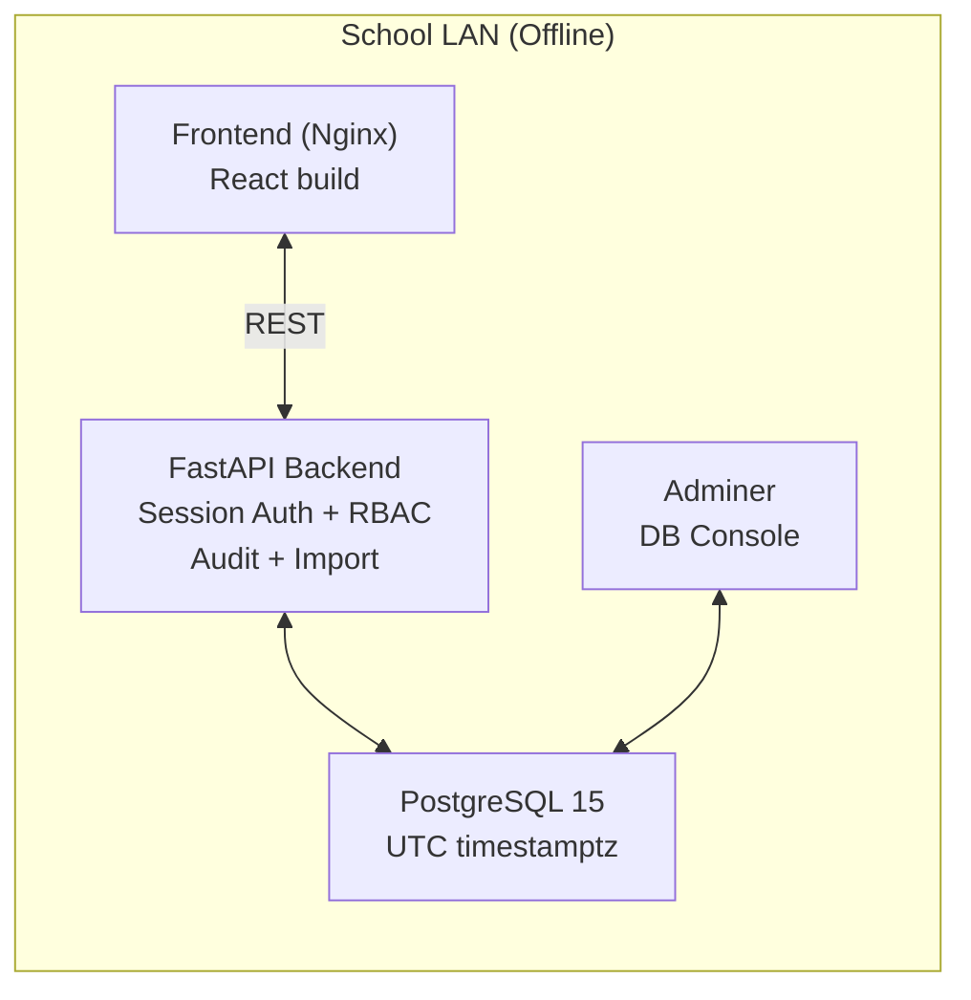
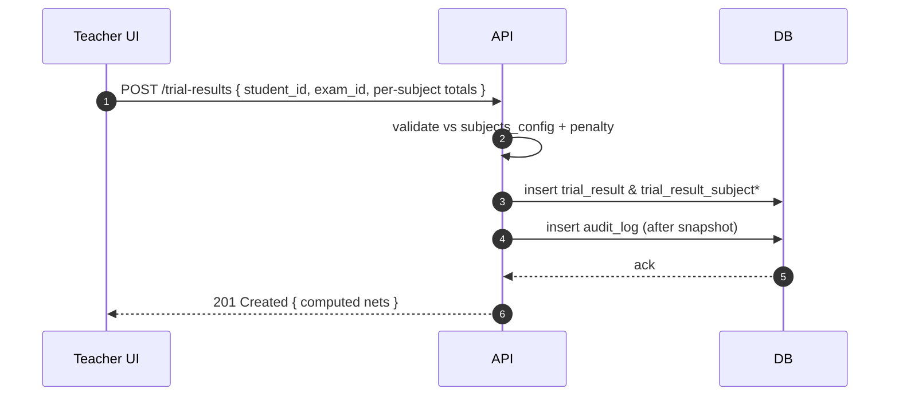

# Architecture

## Components
- **Frontend (React + Vite + Nginx)**: Serves static UI (tr‑TR by default).
- **Backend (FastAPI)**: REST API, session auth, RBAC, auditing, CSV import.
- **PostgreSQL**: Primary datastore.
- **Adminer**: Lightweight DB admin UI.

All components run on a single host via Docker Compose. No internet access required.

## Diagrams

### Component Diagram


### Request Flow (Login + Session)
```mermaid
sequenceDiagram
  autonumber
  actor U as Teacher/Rooter
  participant F as Frontend
  participant A as Backend
  participant D as Postgres

  U->>F: Open login page
  F->>A: POST /auth/login (username/email, password)
  A->>D: verify user + Argon2id hash
  D-->>A: user row
  A-->>F: Set-Cookie: lgs_session=<sid>; HttpOnly; SameSite=Lax
  Note right of A: CSRF cookie set; token required for state changes
  F->>A: GET /me (with cookie)
  A-->>F: user profile + role + scope
```

### Trial Result Entry


## Auth Strategy
- **Server‑side sessions** stored in DB; cookie is `HttpOnly`, `SameSite=Lax`.
- CSRF protection on state‑changing routes via `X-CSRF-Token` header.
- Rate limiting on `/auth/*` endpoints with backoff/lockout after threshold.
- Passwords hashed with **Argon2id** (fallback bcrypt).

## RBAC Matrix (Summary)
| Permission | Rooter | Teacher |
|---|---|---|
| Manage teachers | ✅ | ❌ |
| View students | ✅ | ✅ (within scope) |
| Edit students | ✅ | ✅ (within scope) |
| Import students (CSV) | ✅ | ❌ |
| Create trials | ✅ | ✅ |
| Finalize trials | ✅ | ❌ |
| Enter results | ✅ | ✅ (within scope) |
| Edit finalized results | ✅ (override, audited) | ❌ |
| Assign workbooks | ✅ | ✅ (within scope) |
| View audit logs | ✅ | ❌ |

Detailed rules in `rbac_policy.md`.

## Timezone Strategy
- DB: `timestamptz` (UTC). Client/UI renders in **Europe/Istanbul**.
- Backend uses `pytz/zoneinfo` to convert display timestamps and for reports.

