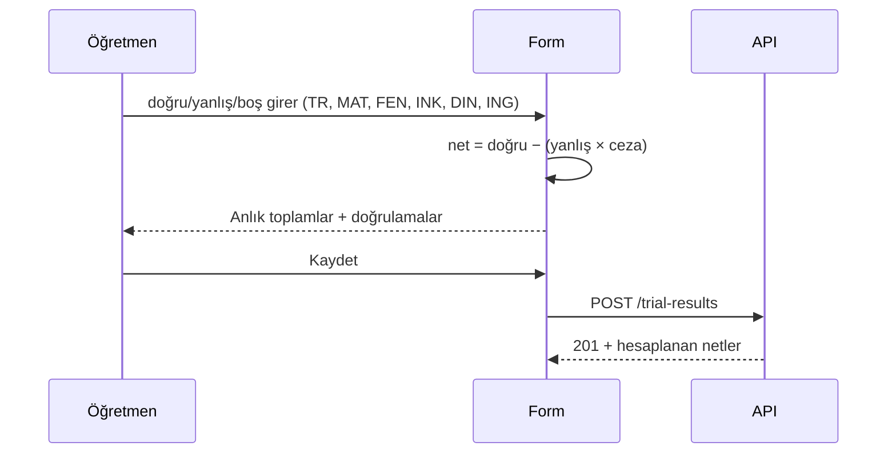
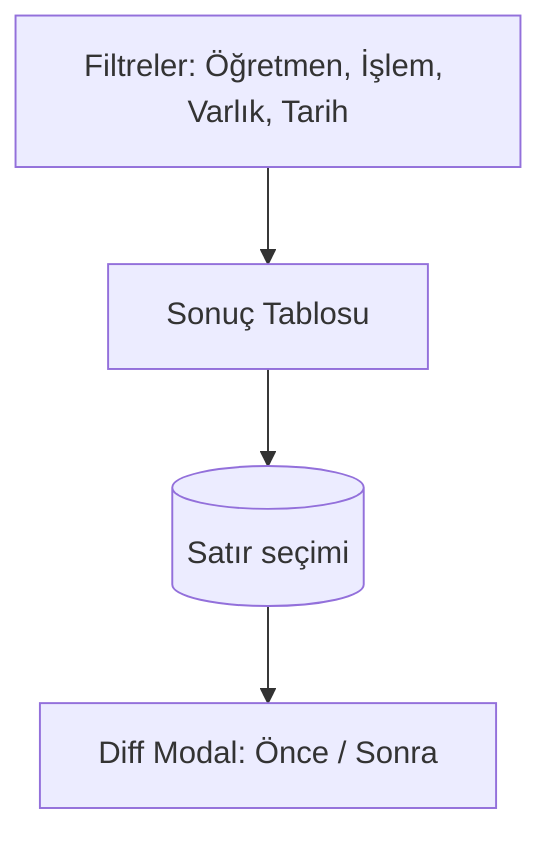

# UI Wireframes (Mermaid)

## Teacher — Landing
```mermaid
flowchart TD
  A[Header: LGS Tracker] --> B[Grade Filter: 5 | 6 | 7 | 8]
  B --> C[Search by name]
  C --> D[Students Table
  - Ad Soyad
  - Sınıf
  - Veli Tel
  - Son Deneme (özet)
  - Kitap %
  - Görüntüle]
  D -->|Select row| E[Student Detail]
```

## Teacher — Student Detail Tabs
```mermaid
flowchart LR
  A[Öğrenci: Mehmet Yılmaz (8/A)] --> B[Genel Bakış]
  A --> C[Denemeler]
  A --> D[Kitaplar]
  A --> E[Notlar]
  A --> F[Etkinlik]
```

### Trial Entry Form (Deneme Kaydı)


## Rooter — Audit Viewer

